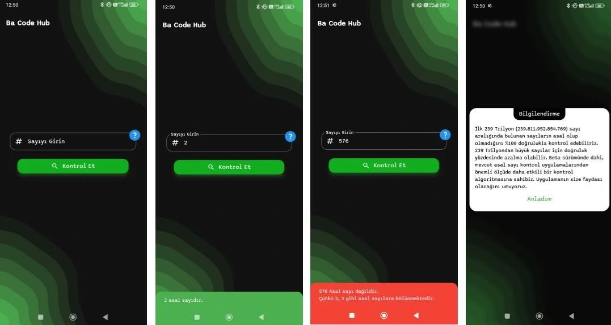

# Prime Number Checker Application

This application allows you to check whether a number within the first 239 trillion (239,811,952,854,769) numbers is prime with 100% accuracy. For numbers larger than 239 trillion, the accuracy may decrease. Even in the beta version, our algorithm is significantly more effective than existing prime number checking applications. We hope this application will be useful to you.

  

## Features

- **High Accuracy:** Check for prime numbers with 100% accuracy up to the first 239 trillion numbers.
- **Unlimited Digit Support:** The application can test numbers with an unlimited number of digits. For example, it can determine whether an 11,658-digit number is prime in an average of 1.92 seconds.
- **Miller-Rabin Algorithm:** The current algorithm is powered by the Miller-Rabin primality test.
- **Future Updates:** In future versions, we plan to integrate the Baillie-PSW test to further enhance the algorithm's accuracy.

## Download

You can download the application from [Google Play Store](https://play.google.com/store/apps/details?id=com.AsalSayiKontrol.BaCode).

## NOTE

The application allows you to test numbers with unlimited digits.

---

With this application, you can easily check whether large numbers are prime and use this information in your projects. Your feedback and suggestions are greatly appreciated.
